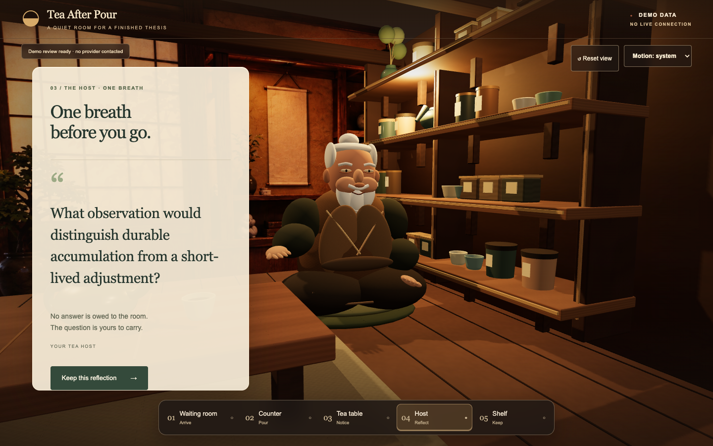
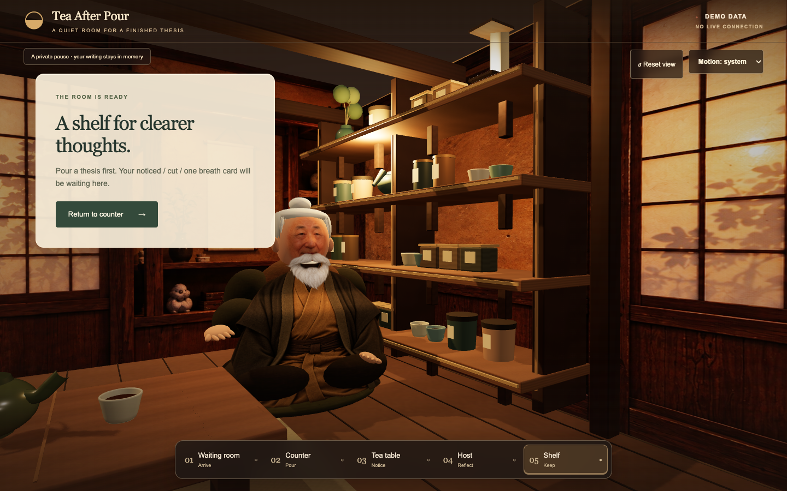
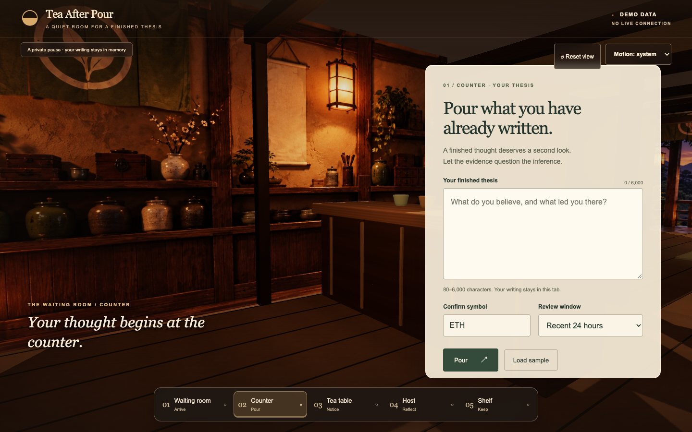

# Tea After Pour

A quiet room for a finished thesis. Write at the counter in a Japanese tea shop, then move through the doorway to a tea table, host and reflection shelf. The room fills the browser window; the review appears over the scene when it is ready.

**The thesis review remains PASS A demo data. Iroh's separate Host research chat calls the live Nansen Research Agent.** The room and Iroh chat are available without an account; login and signup are optional. Set `NANSEN_API_KEY` server-side to use Iroh. No runtime mock answer or fallback is used for chat.

For a concise account of what is finished, what is verified, and what remains before a live release, see the [current project status](docs/project-status.md).








## Run locally

Prerequisites: Node.js 22.12 or newer (tested with 24.10.0), npm, and a modern browser. The exact dependency versions are pinned in `package.json` and `package-lock.json`.

```sh
npm ci
cp .env.example .env.local
npm run db:migrate
# Add your Nansen key to NANSEN_API_KEY in .env.local for Iroh chat.
npm run dev
```

Open [http://127.0.0.1:3000](http://127.0.0.1:3000). The key is needed only for Iroh chat; the thesis demo still runs without it. Restart the server after setting the key. Initial installation requires access to the npm registry. Scene images are bundled in `public/images/`; Iroh research uses Nansen at runtime.

The room opens for guests. Use **Log in / Create account** in the top-right corner only if you want a persistent identity. Accounts use a 3–24 character nickname and a password of at least 8 characters. Nicknames are unique and matched without regard to case; your chosen casing is displayed in the top-right account menu. Logging out invalidates the server session and returns to the guest room. Guest activity stays in browser memory and is not associated with a User ID. Accounts and sessions are stored in the ignored local SQLite file `prisma/dev.db`; run `npm run db:migrate` after pulling database schema changes. The committed Prisma migration defines the database. The database file and its journal files are not committed. SQLite is intended for local development and a single persistent server filesystem.

```sh
npm run typecheck
npm test
npm run build
npm start
```

For repeatable Chromium browser tests:

```sh
npx playwright install chromium
npm run test:e2e
```

The browser suite starts the development server automatically unless one already runs at port 3000. `npm run format:check` checks source formatting.

## Take a seat

1. The page opens in the waiting room at the counter, with the thesis field in a large floating reading card.
2. Choose **Load sample**, confirm **ETH** and **Recent 24 hours**, then **Pour**. The camera travels through the doorway into the tea room while the review runs. The table, host and shelf stay in this room.
3. The tea table presents **NOTICED / CUT / ONE BREATH** after the camera arrives. **Inspect evidence** opens the synthetic receipt, including source, timestamps, metrics, coverage, evidence ID and the challenged phrase.
4. **Take one breath** visits the host. **Keep this reflection** opens the shelf card preview.
   At the Host, **Ask Iroh** opens a separate live research conversation. Send a question, watch Nansen's answer stream, ask a follow-up, Stop generation, or start a New conversation. The conversation stays in memory when you visit another station and return.
5. **Pour another thesis** returns to your preserved writing. The flow is repeatable.

Use the bottom station buttons with Tab and Enter. Drag gently to adjust the local view. Orbit is constrained; zoom, panning, free walking and WASD are absent. **Reset view** restores the station framing. Form focus suspends local camera movement; the trip to Host finishes if chat opens during travel. **Motion: system** respects your OS preference; **Reduce motion** skips camera travel.

**Cancel review** stops an active pour without clearing the thesis. Duplicate pours are blocked. Validation and adapter failures preserve input and allow retry. The evidence dialog supports Escape, traps keyboard focus through native dialog behavior, and restores focus on close.

If WebGL is unavailable or its context is lost, a quiet static backdrop replaces the room. The same form, station controls, results, evidence and card flow remain usable. On narrow screens the room stays full-screen behind a scrollable reading card.

## What the demo means

The fixture is the specification's invented ETH example: twelve synthetic wallets, $1.2m opening/adding long exposure, $0.9m opening/adding short exposure, and capped coverage. Its fixed sample timestamp is **22 September 2026 at 18:00 UTC**; it is not a current retrieval. No provider endorsement is implied.

Only the exact prepared ETH thesis at 24 hours receives that linked example. Other valid writing, symbols or windows receive an explicit **unknown / unassessed** result with no evidence. PASS A does not extract claims or understand arbitrary theses. The symbol is manually confirmed; it is not resolved against a live registry. Theses must contain 80–6,000 trimmed characters.

The card shows only application-owned reflection text, symbol, window, demo status and provenance. It never copies the full thesis, wallet information, transaction references or position sizes. The card is a **preview**; image export, clipboard export, posting and public sharing are not implemented. Review input and results live in memory and are lost on reload. Accounts and sessions are the only persistent records; there is no analytics or review storage.

## Architecture

- `src/app/`: Next.js App Router entry, metadata and responsive visual styles. The HTML shell loads before the dynamically imported scene.
- `src/auth/` and `prisma/`: nickname/password accounts, bcrypt password hashes, opaque database-backed sessions, the server-side `getCurrentUser()` helper, and the SQLite schema/migration. Browser cookies are HttpOnly, SameSite Lax, and Secure in production. Future records should use the server-resolved `user.id`.
- `src/scene/`: one R3F canvas, two connected rooms with physical floor, counter, tea table, a seated photo-textured 3D host and a right-wall tea display, image-backed wall scenery, authored camera anchors and a constrained drei camera rig. DPR is capped at 1.5. Images are bundled locally.
- `src/ui/`: `TeaRoomShell` coordinates station and form state; `ThesisPanel`, `ResultScroll`, `EvidenceDrawer` and `ShareCard` provide accessible HTML interfaces.
- `src/shared/contracts.ts`: `ReviewInput`, `EvidenceItem`, `Finding`, `InterrogationResult`, `ReviewCard`, `ReviewAdapter` and input validation.
- `src/fixtures/`: fixed synthetic evidence and prepared thesis.
- `src/review/mock-adapter.ts`: deterministic `MockReviewAdapter`, with an abortable simulated delay and no networking.
- `src/review/session.ts`: request ownership, duplicate protection, cancellation, errors and stale-response rejection. Camera transitions never control request lifetime.
- `src/nansen/`: SSE parsing and the in-memory Iroh chat session. The browser calls only `/api/nansen-agent`; the server route calls `https://api.nansen.ai/api/v1/agent/fast` with `process.env.NANSEN_API_KEY` in the `apikey` header. It relays validated SSE events as they arrive, including the `conversation_id` from `finish` for follow-ups. One Send makes one agent request. Stop aborts the browser request and cancels upstream work where possible. New conversation clears the ID and history.
- `tests/`: contract/lifecycle unit tests and complete browser journeys, including reduced motion, early navigation, mobile and WebGL failure.

`ReviewSession.onPour(input): Promise<InterrogationResult>` owns thesis-review retrieval. The camera starts toward TeaTable immediately after valid input; the result is revealed there after arrival. `showCard(card)` presents the matching card at Shelf. A `ReviewAdapter` is injected into the shell. PASS B can add a client transport adapter returning the same result contract. The live Iroh API route is separate from this review adapter.

## Motion behavior

Station travel uses quintic easing; crossing between the two rooms takes about three seconds, while closer station changes use shorter distance-aware moves. The camera passes through an actual opening in the dividing wall, preserves momentum when redirected, and adds a 2mm final settling arc. Local orbit pauses during travel; tiny camera drift stops while typing or inspecting evidence. The 3D host has only a subtle breathing movement.

Pour starts the room transition, followed by a short teapot tip around its foot rim, a brief stream and increased steam. Review work is independent of camera movement; the reading card waits until the camera reaches the tea room. Cancellation or an early result gently returns the pot to rest. All scene motion uses R3F's coordinated loop and refs; HTML reveals use short CSS animations with readable text from the first frame. No animation library or additional rendering loop was added.

The motion selector controls both HTML and WebGL. Reduced motion skips camera travel and removes camera drift, host breathing, steam and spatial UI animation while keeping all state information and controls. Full motion is an explicit override of the system preference.

## Assets and limitations

The room uses locally generated scene images for the tea-room back wall, right wall and counter wall. The user-supplied screenshot guided their style and composition; it is not embedded in the app. The grandfather has a sculpted 3D head and body with curved facial, beard and garment textures. The physical tea shelf stands in front of the decorated right wall. The counter, doorway, floor, table, teapot, cups, rug and camera travel are also three-dimensional. Typography uses installed Georgia and Arial/Helvetica fallbacks. There are no remote artwork, font or audio requests. Third-party libraries retain their package licenses.

The host is an authored 3D character with realistic image textures, not a scanned person or a rigged animation model. The room has controlled parallax rather than a freely walkable environment. The motion layer adds a short teapot tip, nine soft steam sprites and restrained lighting/UI responses. No voice, lip sync, external models or physics engine is used. Performance varies by GPU; formal frame-rate benchmarks are not claimed. Browser checks use Chromium; Safari and Firefox have not been separately certified.

If port 3000 is occupied, stop the other server or use `npm run dev -- --port 3001`. If an interrupted build leaves stale Next.js artifacts, stop the server, remove `.next`, and restart. A blank 3D area should recover to the fallback; all primary actions are also available through HTML.

## Intentionally left for PASS B

Live symbol resolution and Nansen evidence retrieval **for the thesis-review flow**; claim extraction and grounded rules; real partial-data handling; full card export; hosting, demo recording and release/submission work. Iroh's research chat is live and separate from that flow. No real-key Nansen call is made by the automated tests; use a configured local key for the first live check.
