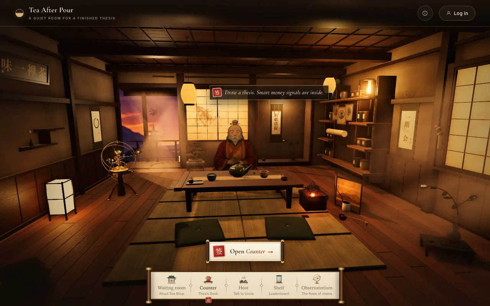
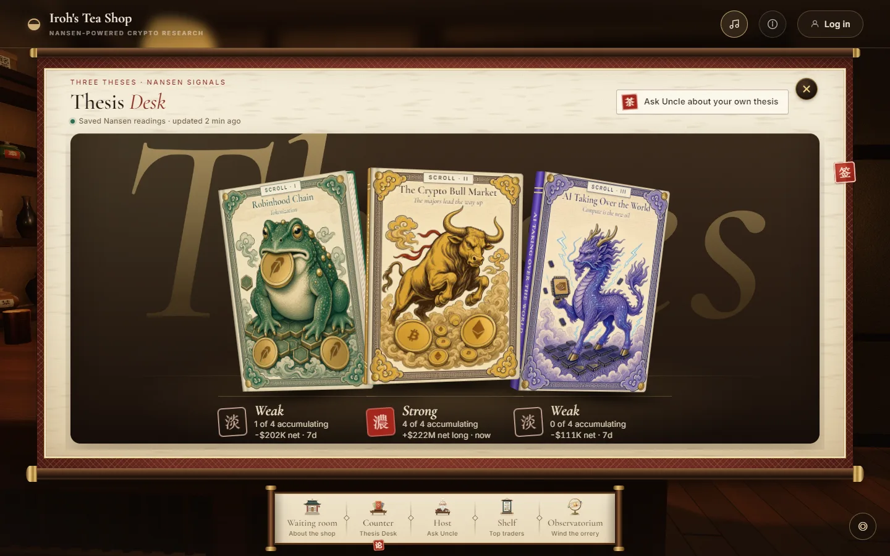
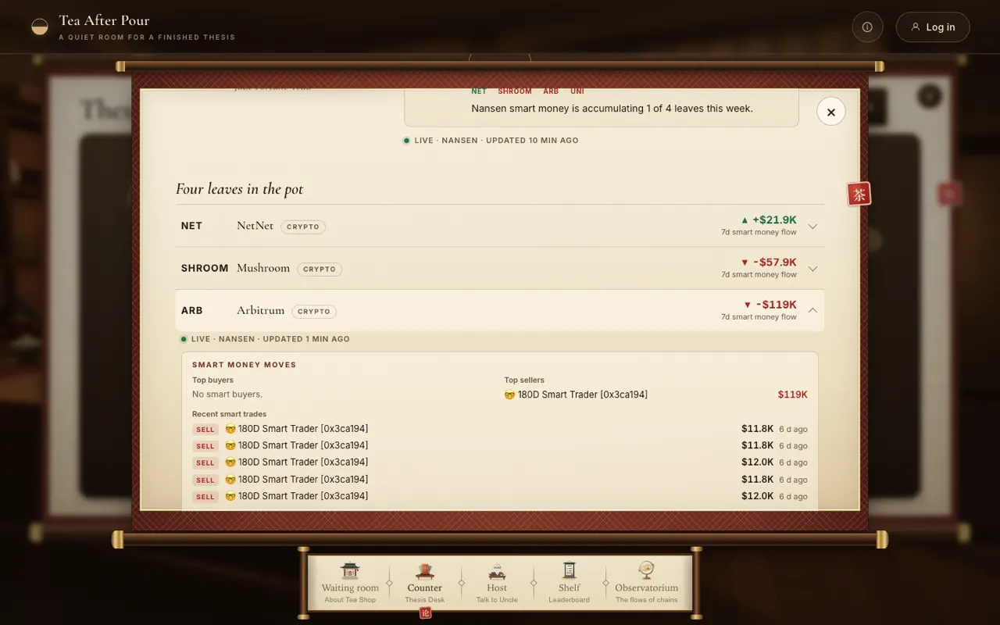
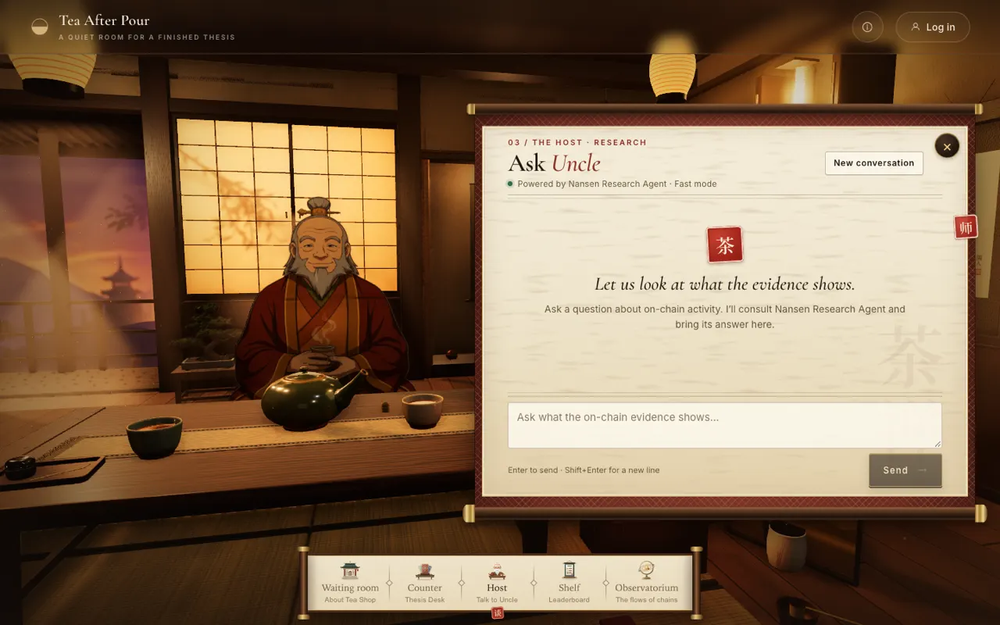
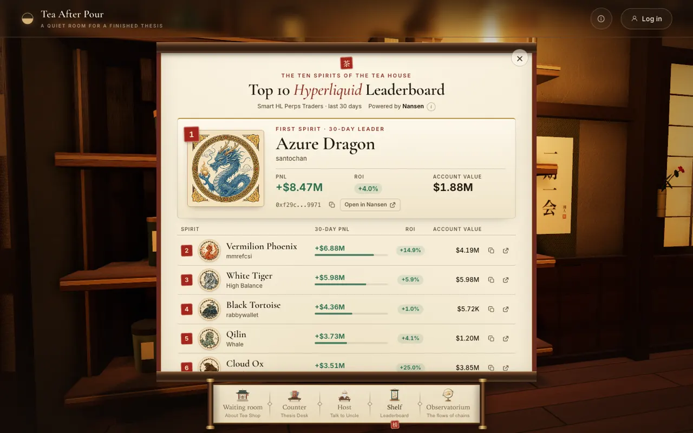

# Iroh's Tea Shop

A small 3D tea shop where you can check three crypto ideas against what smart money is actually doing.

You walk in through a sketchbook, then move around the room. The counter holds three thesis books. Uncle, the host, will talk with you. The shelf shows the ten strongest Hyperliquid perp traders from the last 30 days, drawn as spirits. A brass orrery sits in the corner and does not show market data.

The shop is a Next.js app. Market numbers come from [Nansen](https://nansen.ai). Most of those numbers are saved in a SQLite database on the server and refreshed about once an hour, so opening a page does not call Nansen. Talking to Uncle does. Each message is a live question.

Live demo: <https://iroh-tea-shop.up.railway.app>







## Run it locally

You need Node.js 22.12 or newer, npm, and a current browser.

```sh
npm ci
cp .env.example .env.local
```

Put your Nansen key in `.env.local`:

```sh
NANSEN_API_KEY=your-key
```

The key stays on the server. Do not put it in a `NEXT_PUBLIC_` variable. Restart the dev server after you change `.env.local`.

```sh
npm run db:migrate
npm run dev
```

Open <http://127.0.0.1:3000>. If that port is taken: `npm run dev -- --port 3101`.

`npm run db:migrate` creates the local database file and applies migrations. The path is `DATABASE_URL` in `.env` (not `.env.local`, because the Prisma CLI reads only `.env`). Copy the line from `.env.example`: `file:./dev.db`, which Prisma stores as `prisma/dev.db` (git ignores it). Each checkout has its own file. Skip this and sign-in breaks, because the session table is missing. The same command creates the table that holds saved Nansen readings. On Railway, set `DATABASE_URL=file:/data/dev.db` and mount a volume at `/data` on the one web replica.

Optional. Uncle's live chat is limited to one message per IP address per UTC day. Change that with `NANSEN_AGENT_DAILY_LIMIT` in `.env.local`. The default is 1.

When the server starts, it fills the database in the background, then does it again about every hour. The first minute after boot, the thesis desk and the shelf can say the readings are still being saved. That is the fill running. It is not a visitor waiting on a live call.

## What is saved, and what is live

Two different things happen with Nansen.

**Saved readings.** The thesis seals, the asset pages, and the shelf ranking are written into SQLite. Visitors read that copy. The server asks Nansen when it boots, and then about once an hour, and replaces the rows. If an hourly update fails, the previous row stays and the screen can mark it stale.

**Uncle.** Chat is not a saved dataset. When you send a message, the server calls Nansen's Research Agent right then (`agent/fast`). The reply is streamed back. Signed-in chats are stored so you can reopen them. The Nansen request itself is still live, and it is not part of the hourly save.

A full background save makes **94 Nansen requests**:

| What it fills      | Requests | Where they go                                                                                                                                                                     |
| ------------------ | -------: | --------------------------------------------------------------------------------------------------------------------------------------------------------------------------------- |
| Thesis deck        |       12 | One per asset. Tokens use 7-day smart-money flow. Bitcoin, Ether, Hyperliquid, and Solana use open perp positions (longs minus shorts).                                           |
| Asset detail pages |       67 | Buyers, sellers, recent trades, holders, and token info for everything except Solana. Perp books for assets that trade as perps. Solana only asks for the perp book (2 requests). |
| Shelf              |       15 | Three boards (Perps Traders, Smart Wallets, Mem Traders) and five sorts. Account holdings reuses the account-value row.                                                           |

12 + 67 + 15 = 94. Those calls are paced by the server so they do not all fire at once. They are not triggered by someone opening the desk or the shelf.

Stock tokens (NVIDIA, Micron, SanDisk) still request token info, but the page hides "supply not yet circulating" for them. A stock's share count is not the story. Bitcoin, Ether, and Hyperliquid also look at the spot token on their detail page, on top of the perp signal used for the seal.

The three essays are written by the team. Nansen does not write them. Nansen supplies the conviction seal and the evidence under each asset.

Conviction, in plain words: a thesis looks at its four assets. An asset "counts" when Nansen returned a real smart-money number. It is "accumulating" when that number is positive. The seal is **strong** when at least three quarters of the counted assets are accumulating, **building** when at least half are, **weak** otherwise, and **no signal** when nothing counted.

## A walk through the room

1. **Waiting room.** A sketchbook. Enter the tea room when you want the stations.
2. **Counter.** Three books: Robinhood Chain Tokenization, The Crypto Bull Market, and AI Taking Over the World. Each book has a conviction seal from the saved readings. Open a book, then open an asset, to see buyers and sellers, holders, supply that is not circulating yet, and perp positioning. You can ask Uncle about it, share it on X, or follow it in this browser.
3. **Host.** Talk to Uncle. Guests keep the conversation until they leave the page. Signed-in people get a list of old chats.
4. **Shelf.** Ten hanging papers, one spirit each. "See the top traders" unrolls the saved leaderboard. The spirit names are a cast we drew. They are not the traders' real names. A rank opens that wallet in Nansen's profiler.
5. **Observatorium.** Wind the orrery. No market data.

Sign-in is optional. It is a nickname and a password, stored in the same SQLite file as chats and saved readings. Guests can use the room without an account.

## Where the code lives

| Folder                                  | What it is                                                                                             |
| --------------------------------------- | ------------------------------------------------------------------------------------------------------ |
| `src/thesis/`                           | The three theses, how conviction is scored, and the Nansen requests that build a deck or an asset page |
| `src/nansen/`                           | The Nansen client, Uncle's chat, the hourly save, and the SQLite snapshot store                        |
| `src/app/api/theses/`                   | Reads the saved deck and the saved asset pages                                                         |
| `src/app/api/smart-wallet-leaderboard/` | Reads the saved shelf ranking                                                                          |
| `src/app/api/nansen-agent/`             | Uncle's live chat                                                                                      |
| `src/scene/`                            | The 3D room                                                                                            |
| `src/ui/`                               | Panels, the thesis books, the shelf scroll, the dock                                                   |
| `src/leaderboard/`                      | Turns the Nansen leaderboard payload into the ten rows                                                 |
| `src/auth/`, `src/iroh/`, `prisma/`     | Accounts, chat history, and the database                                                               |

The save starts from `src/instrumentation.ts` when the Node server boots. It is skipped during `next build`, so a production build does not spend Nansen requests.

A longer plain-language tour is in [docs/project-status.md](docs/project-status.md). Older handoff notes in `docs/handoff/` are history from earlier passes. If they disagree with this file, trust this file.

## Checks

```sh
npm run typecheck
npm test
npm run format:check
npm run build
PLAYWRIGHT_BASE_URL=http://127.0.0.1:3101 npm run test:e2e
```

Unit tests mock Nansen. They do not spend credits. Browser tests mock the app's own API responses.

## Limits worth knowing

- One Node process, one SQLite file. If you run several copies of the server, each copy has its own database and each copy refreshes Nansen about once an hour. The intended deploy is a single web process with `DATABASE_URL` pointed at a volume.
- Uncle's daily cap lives in that process. It trusts the proxy's forwarding headers, resets at midnight UTC, and also resets if the process restarts.
- The host's 3D model is still a work in progress. The writing says Uncle. The mesh still looks like the earlier grandfather.
- The app is deployed on Railway at the link above. Railway runs `prisma migrate deploy` before the server starts, so the snapshot table exists before the first fill.
