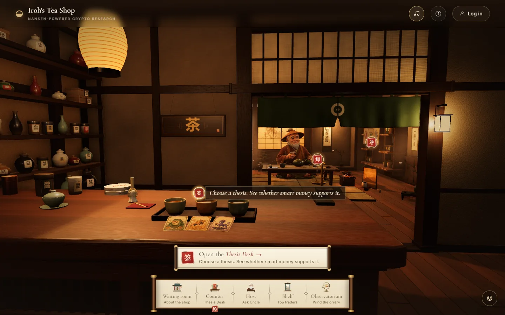

# Iroh's Tea Shop

A 3D tea shop in your browser. In it, you check three crypto theses against what smart money does. Smart money means wallets that [Nansen](https://nansen.ai) labels as funds or skilled traders. All market data comes from Nansen.

**Live site:** <https://iroh-tea-shop.up.railway.app>



## What you can do

You start outside the shop, in front of a sketchbook. Press **Enter Teashop** when the room has loaded. A dock at the bottom of the screen then takes you to four stops:

| Stop              | What you do there                                                                 |
| ----------------- | --------------------------------------------------------------------------------- |
| **Counter**       | Read three theses and see how many of their assets smart money is accumulating.   |
| **Host**          | Ask Uncle, the shop's host, a question. Nansen's Research Agent finds the answer. |
| **Shelf**         | See the top ten wallets on four trader leaderboards.                              |
| **Observatorium** | Wind a brass orrery, a clockwork model of the planets. It shows no market data.   |

The first dock button, **Waiting room**, takes you back to the sketchbook.

### Waiting room


The sketchbook explains the project and introduces the five people who built it. Drag a page, or press the arrow keys, to turn it. The **Enter Teashop** button fills like a tea bowl while the 3D room loads.

### Counter: the Thesis Desk


The team wrote three theses. On the desk, each thesis is a book about four assets:

| Thesis                       | Assets                              |
| ---------------------------- | ----------------------------------- |
| Robinhood Chain Tokenization | NetNet, Mushroom, Arbitrum, Uniswap |
| The Crypto Bull Market       | Bitcoin, Ether, Hyperliquid, Solana |
| AI Taking Over the World     | Venice, SanDisk, NVIDIA, Micron     |

Each book has a conviction seal: **Strong**, **Building**, **Weak**, or **No signal**. The seal shows how many of the four assets smart money is accumulating. For two theses, accumulating means that smart money bought more than it sold in the last 7 days. For The Crypto Bull Market, it means that smart money holds more long bets than short bets on Hyperliquid. [The conviction seal](docs/how-it-works.md#the-conviction-seal) gives the exact rule. The seal summarizes wallet data. It does not say that the thesis is right.

Open a book to read the thesis. Open an asset to see the evidence: top buyers and sellers, holders, locked supply, and perpetual futures (perp) positions.


From an open thesis you can:

- **Ask Uncle about this thesis.** This types a question in the Host panel. You decide whether to send it.
- **Share** it with **Post on X** or **Copy link**.
- **Follow this thesis.** This shows referral links to four trading apps: Arcus, FOMO, Omni, and Hyperliquid.

A link such as `/?thesis=bullrun` skips the waiting room and opens that thesis. The three IDs are `robinhood`, `bullrun`, and `ai`.

### Host: ask Uncle


Uncle is the old tea master who runs the shop. He answers questions about tokens, wallets, and markets. Nansen's Research Agent writes each answer when you ask. A question can be up to 100 characters.

The shop pays for **one free message per IP address per day**. Uncle calls it a cup. The count resets at midnight UTC. When you have used your free message, Uncle shows two buttons:

- **Enter your key.** Paste your own Nansen API key. Your browser keeps it and uses it for Uncle only.
- **Get a Nansen API key ↗.** This opens [nsn.ai/iroh0x](https://nsn.ai/iroh0x).

If you are not logged in, a page reload clears the chat. If you log in, your chats stay in **Chat history**.

### Shelf: top traders


The Shelf has four boards. Each board shows ten wallets from the last 30 days:

- **Perps Traders**: Hyperliquid wallets that Nansen labels Smart HL Perps Trader.
- **Smart Wallets**: Hyperliquid wallets that Nansen labels as funds or smart traders.
- **Whales**: Hyperliquid accounts worth $10M or more.
- **Meme Traders**: Smart Money wallets on 18 chains, Solana and EVM, whose profit comes mostly from memecoins.

Each rank gets an illustrated spirit, for example Azure Dragon for rank 1. The spirits are art. They say nothing about who owns the wallet. **Research in Nansen** opens the wallet in Nansen's profiler.


### Observatorium


Click the orrery to wind it. **Open the planetary model** opens the team's separate planetary model site in a new tab.

### Moving around the room

- Drag to look around. Scroll or pinch to zoom. Double-click the floor to walk there.
- Click a glowing seal in the room to go to its stop. If you are already at that stop, the seal opens its panel.
- Press **◎** (Recenter view) to put the camera back.
- Press **Escape** to close a panel.

**Log in** at the top right is optional. You need only a nickname and a password. An account keeps your chats with Uncle.

## Where the numbers come from

The shop uses Nansen in two ways.

**Saved readings.** The Thesis Desk and the Shelf never call Nansen when you open them. Instead, the server asks Nansen on a schedule and saves the answers in its SQLite database. This is the background save. The desk and the Shelf show these saved answers, called readings. The server refreshes them on two schedules:

- Every hour: the thesis seals, and the buyers, sellers, recent trades, and perp positions on the asset pages.
- Every 4 hours: the holders and token information on the asset pages, and every Shelf board.

Every fourth hour, a full save makes up to 103 Nansen requests. The hourly saves in between make 57 Nansen requests. These counts assume that nothing fails. If a save fails, the old reading stays on screen, marked as stale.

**Live answers.** Uncle does not use saved readings. Each message calls Nansen's Research Agent (`agent/fast`) at that moment.

[How the tea shop works](docs/how-it-works.md) has the full rules.

## Run it locally

You need Node.js and npm. Use Node.js 24.10.0, the version in `.nvmrc` and on Railway. The commands below work in bash, zsh, Git Bash, and PowerShell.

1. Get the code:

   ```sh
   git clone https://github.com/White-Lotus-Labs/iroh-tea-shop.git
   cd iroh-tea-shop
   ```

2. Install the packages:

   ```sh
   npm ci
   ```

3. Copy the settings file:

   ```sh
   cp .env.example .env.local
   ```

4. Optional: to see real market data, put a Nansen API key in `NANSEN_API_KEY` in `.env.local`. Read the warning below first. Skip this step to spend nothing.

5. Start the app. `npm run dev` first creates the database at `prisma/dev.db` and applies the migrations:

   ```sh
   npm run dev
   ```

6. Open <http://127.0.0.1:3000>. If port 3000 is busy, Next.js uses the next free port and prints it.

Without a key, the terminal prints `Nansen refresh skipped: API key is not set.` The Thesis Desk then says "Nansen is not configured." and the Shelf says "Nansen research is offline." This is expected. With a key, the panels first say that market readings are still being saved. When the terminal prints `Nansen refresh saved …`, press **Try again**.

> **A key spends Nansen credits.** With `NANSEN_API_KEY` set, the server saves readings as soon as it starts. The first start with an empty database makes up to 103 requests. After that, the server makes 57 requests each hour and up to 103 every fourth hour. That is up to 1,644 requests a day. Each free Uncle message also uses the key. To spend nothing, leave the key empty in `.env.local`. If your shell also sets `NANSEN_API_KEY`, remove it there too, because the shell value wins. You can still paste your own key in the Host panel to talk to Uncle.

`NANSEN_API_KEY` is the house key: the shop's own Nansen key. It stays on the server. Never put it in a `NEXT_PUBLIC_` variable, because Next.js sends those variables to the browser.

[Development notes](docs/development.md) list the settings, scripts, and test suites.

## Checks

```sh
npm run typecheck
npm test
npm run format:check
npm run build
npx playwright install chromium
npm run test:e2e
```

- The unit tests (`npm test`) replace Nansen with recorded answers. They spend nothing.
- `npx playwright install chromium` is needed once, before the first browser test run.
- The browser tests (`npm run test:e2e`) use the server on port 3000, for example the one from step 5. If none runs, they start `npm run dev`. That server runs the real background save, so a key in `.env.local` can spend Nansen credits.
- CI runs the format check, typecheck, unit tests, and build on each pull request. It skips the browser tests, so run those yourself before you push.

## Deploy

The site runs on Railway, as one `web` service with one replica. A push to `main` starts a deploy. Check in Railway that the deploy started. Railway runs this start command. The command lives in the Railway settings, not in this repo:

```sh
node scripts/migrate-db.mjs && npx next start --hostname 0.0.0.0 --port ${PORT:-3000}
```

The service sets `DATABASE_URL=file:/data/dev.db` and mounts a volume at `/data`, so the database survives deploys.

## Where the code lives

| Folder                              | What it holds                                                               |
| ----------------------------------- | --------------------------------------------------------------------------- |
| `src/app/`                          | Next.js pages and API routes                                                |
| `src/scene/`                        | The 3D room: camera, props, the host, the orrery                            |
| `src/ui/`                           | Panels, the Thesis Desk, the Shelf, the dock, the waiting room              |
| `src/thesis/`                       | The three theses, the conviction rule, and the Nansen calls for each asset  |
| `src/leaderboard/`                  | The four Shelf boards, the meme filter, and the Nansen leaderboard calls    |
| `src/nansen/`                       | The Nansen client, the background save, the request queue, and Uncle's chat |
| `src/auth/`, `src/iroh/`, `prisma/` | Accounts, saved chats, and the database schema                              |
| `scripts/`                          | Database setup, screenshots, and audit scripts                              |
| `tests/`                            | Unit tests; browser tests are in `tests/browser/`                           |

In the code, "Iroh" means Uncle.

## Known limits

- The shop runs as one server process with one SQLite file. A second copy would keep its own database, run its own saves, and count free messages on its own.
- The free-message count lives in server memory. It resets at midnight UTC and when the server restarts.
- Your own Nansen key sits as plain text in your browser's `localStorage`. **Clear** in the Host panel removes it.
- Accounts have no password reset.

## More documentation

- [How the tea shop works](docs/how-it-works.md): every stop, the data rules, and what you see when something fails.
- [Development notes](docs/development.md): settings, scripts, tests, and deploy details.
- [Nansen request queue](docs/nansen-request-manager.md): how the server paces its calls to Nansen.
- [Visual rubric](docs/visual-rubric.md) and [visual scores](docs/visual-scores.md): how the team scores the look of the room.
- [Performance budget](docs/perf-budget.md) and [visual QA, 27 September 2026](docs/qa/visual-qa-2026-09-27.md): dated records.
