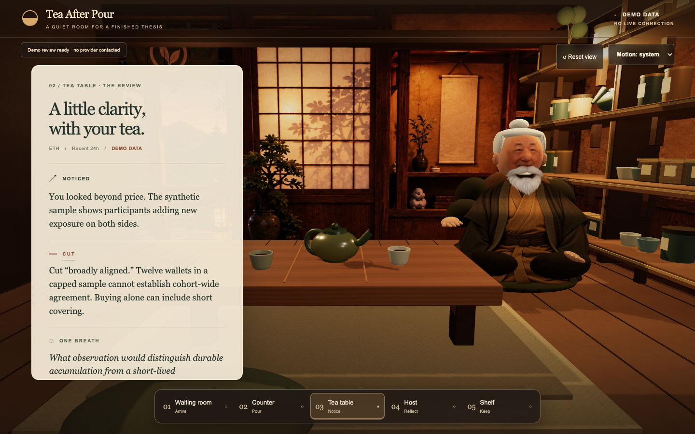

# Tea After Pour

A quiet room for a finished thesis. Bring your reasoning to a warm, guided 3D tea room; separate a supported observation from an unsupported inference; leave with one reflection question.

**PASS A is a mock experience. Every result is labeled DEMO DATA. No Nansen, Hyperliquid or LLM service is called. No credentials are required.**



## Run locally

Prerequisites: Node.js 22.12 or newer (tested with 24.10.0), npm, and a modern browser. The exact dependency versions are pinned in `package.json` and `package-lock.json`.

```sh
npm ci
cp .env.example .env.local
npm run dev
```

Open [http://127.0.0.1:3000](http://127.0.0.1:3000). Copying the environment template is optional; it contains comments only. Initial installation requires access to the npm registry. Once installed, the app has no remote runtime asset or data dependencies.

```sh
npm run typecheck
npm test
npm run build
npm start
```

For repeatable Chromium browser tests:

```sh
npx playwright install chromium
npm run test:e2e
```

The browser suite starts the development server automatically unless one already runs at port 3000. `npm run format:check` checks source formatting.

## Take a seat

1. The entrance automatically settles at the counter after a brief arrival. **Skip to counter** and all five station buttons are available immediately.
2. Choose **Load sample**, confirm **ETH** and **Recent 24 hours**, then **Pour**.
3. The tea table presents **NOTICED / CUT / ONE BREATH**. **Inspect evidence** opens the synthetic receipt, including source, timestamps, metrics, coverage, evidence ID and the challenged phrase.
4. **Take one breath** visits the host. **Keep this reflection** opens the shelf card preview.
5. **Pour another thesis** returns to your preserved writing. The flow is repeatable.

Use the bottom station buttons with Tab and Enter, or click the room's station signs. Drag the room gently to adjust the local view. Orbit is constrained; zoom, panning, free walking and WASD are absent. **Reset view** restores the station framing. Form focus suspends camera movement. **Motion: system** respects your OS preference; **Reduce motion** skips camera travel. Station choices override automatic arrival.

**Cancel review** stops an active pour without clearing the thesis. Duplicate pours are blocked. Validation and adapter failures preserve input and allow retry. The evidence dialog supports Escape, traps keyboard focus through native dialog behavior, and restores focus on close.

If WebGL is unavailable or its context is lost, a quiet static backdrop replaces the room. The same form, station controls, results, evidence and card flow remain usable. Narrow layouts place the room above a single-column reading panel.

## What the demo means

The fixture is the specification's invented ETH example: twelve synthetic wallets, $1.2m opening/adding long exposure, $0.9m opening/adding short exposure, and capped coverage. Its fixed sample timestamp is **22 September 2026 at 18:00 UTC**; it is not a current retrieval. No provider endorsement is implied.

Only the exact prepared ETH thesis at 24 hours receives that linked example. Other valid writing, symbols or windows receive an explicit **unknown / unassessed** result with no evidence. PASS A does not extract claims or understand arbitrary theses. The symbol is manually confirmed; it is not resolved against a live registry. Theses must contain 80–6,000 trimmed characters.

The card shows only application-owned reflection text, symbol, window, demo status and provenance. It never copies the full thesis, wallet information, transaction references or position sizes. The card is a **preview**; image export, clipboard export, posting and public sharing are not implemented. Input and results live in memory and are lost on reload. No database, accounts, analytics or storage are used.

## Architecture

- `src/app/`: Next.js App Router entry, metadata and responsive visual styles. The HTML shell loads before the dynamically imported scene.
- `src/scene/`: one R3F canvas, primitive room geometry, stylized mesh host, textured station signs, authored camera anchors and a constrained drei camera rig. One shadow-casting light; DPR capped at 1.5. No downloaded fonts, models or textures.
- `src/ui/`: `TeaRoomShell` coordinates station and form state; `ThesisPanel`, `ResultScroll`, `EvidenceDrawer` and `ShareCard` provide accessible HTML interfaces.
- `src/shared/contracts.ts`: `ReviewInput`, `EvidenceItem`, `Finding`, `InterrogationResult`, `ReviewCard`, `ReviewAdapter` and input validation.
- `src/fixtures/`: fixed synthetic evidence and prepared thesis.
- `src/review/mock-adapter.ts`: deterministic `MockReviewAdapter`, with an abortable simulated delay and no networking.
- `src/review/session.ts`: request ownership, duplicate protection, cancellation, errors and stale-response rejection. Camera transitions never control request lifetime.
- `tests/`: contract/lifecycle unit tests and complete browser journeys, including reduced motion, early navigation, mobile and WebGL failure.

`ReviewSession.onPour(input): Promise<InterrogationResult>` owns retrieval. The shell's `onInterrogation(result)` presents an accepted result at TeaTable; `showCard(card)` presents the matching card at Shelf. A `ReviewAdapter` is injected into the shell. PASS B can add a client transport adapter returning the same result contract, with real provider code and secrets behind a server route. No live adapter or API route exists in PASS A.

## Motion behavior

Station travel uses distance-aware quintic easing (roughly 0.5–1.5 seconds), preserves momentum when redirected, and adds a 2mm final settling arc. Local orbit pauses during travel; tiny camera drift stops while typing or inspecting evidence. Host attention responds to station/workflow changes rather than continuously tracking the camera. Blink, gaze and posture schedules use different bounded intervals.

Pour gives immediate button feedback, then a short teapot tip around its foot rim, a brief stream and increased steam. Results appear when the adapter resolves, without waiting for the gesture. Cancellation or an early result gently returns the pot to rest. All scene motion uses R3F's coordinated loop and refs; HTML reveals use short CSS animations with readable text from the first frame. No animation library or additional rendering loop was added.

The motion selector controls both HTML and WebGL. Reduced motion removes camera drift, host idles, steam and spatial UI animation while keeping all state information and controls. Full motion is an explicit override of the system preference.

## Assets and limitations

Room geometry, host, sign textures and CSS were created in this repository. Typography uses the browser's installed Georgia and Arial/Helvetica fallbacks; there are no bundled third-party artwork, fonts or audio assets. The supplied specification informed the design; its concept image is not used as a production asset. Third-party libraries retain their package licenses.

The room is a lightweight stylized prototype, not a detailed environment. The motion layer adds procedural breathing, irregular blinks and gaze, a short teapot tip, nine soft steam sprites and restrained lighting/UI responses. No voice, lip sync, external models or physics engine is used. Performance varies by GPU; formal frame-rate benchmarks are not claimed. Browser checks use Chromium; Safari and Firefox have not been separately certified.

If port 3000 is occupied, stop the other server or use `npm run dev -- --port 3001`. If an interrupted build leaves stale Next.js artifacts, stop the server, remove `.next`, and restart. A blank 3D area should recover to the fallback; all primary actions are also available through HTML.

## Intentionally left for PASS B

Live symbol resolution and Nansen evidence retrieval; server-side credentials and request limits; claim extraction and grounded rules; real partial-data handling; full card export; hosting, demo recording and release/submission work. None is necessary to run PASS A, and none is implemented here.
