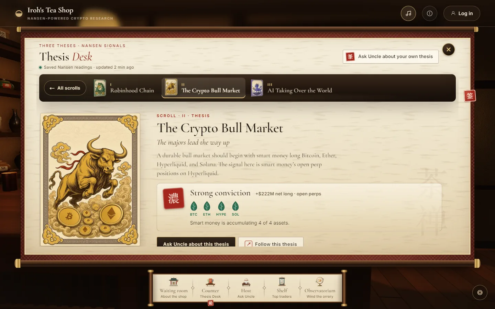
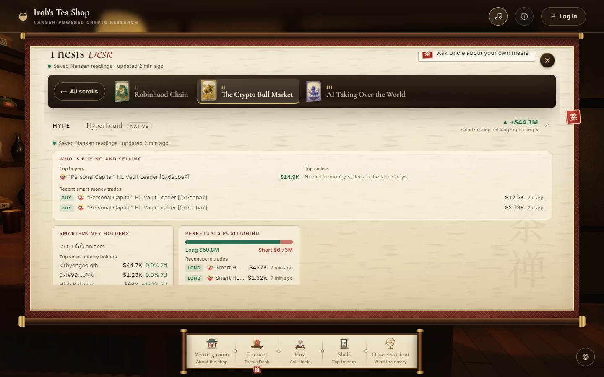
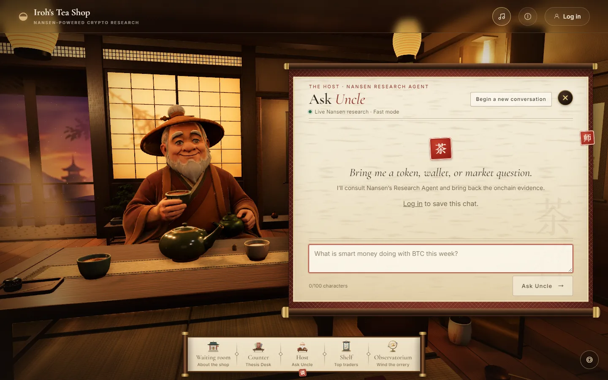
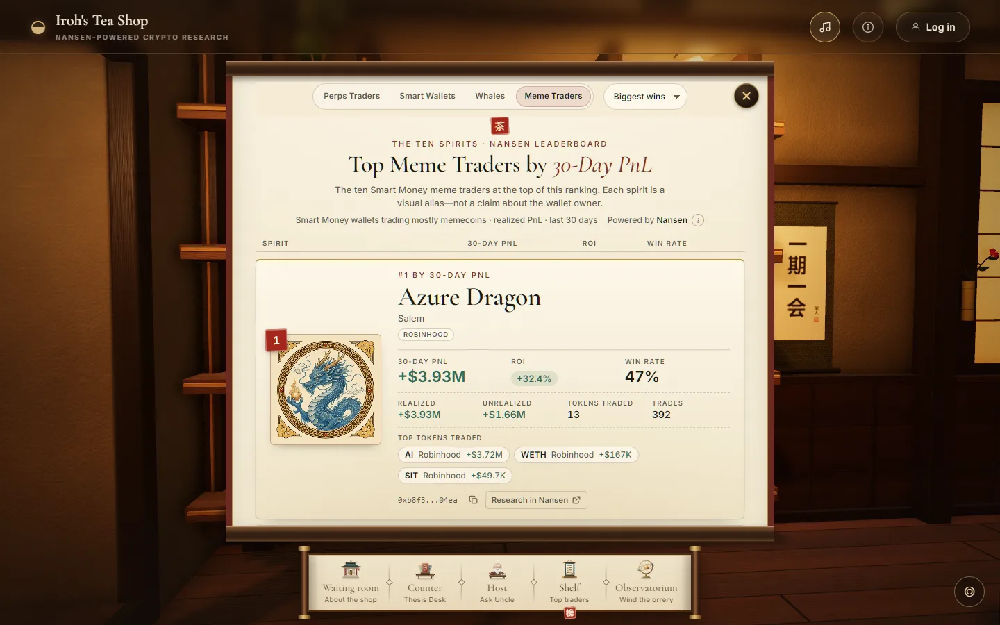
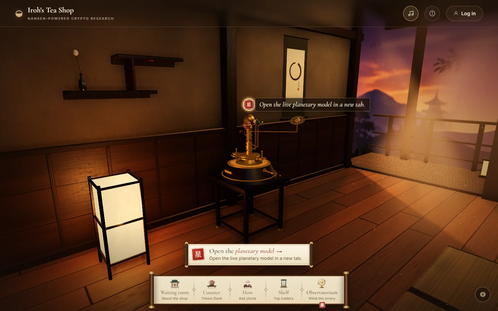

# How the tea shop works

**Updated:** 29 September 2026

This guide describes the app as it runs today. You do not need to know the code to read it. Setup steps are in the [README](../README.md). Settings, scripts, and tests are in [Development notes](development.md).

The live site is <https://iroh-tea-shop.up.railway.app>.

## Words used in this guide

| Word         | Meaning                                                                        |
| ------------ | ------------------------------------------------------------------------------ |
| Smart money  | Wallets that Nansen labels as funds or skilled traders                         |
| Net flow     | What smart money bought minus what it sold                                     |
| Perp         | A perpetual futures contract: a bet on a price that has no end date            |
| Long, short  | A bet that the price goes up (long) or down (short)                            |
| PnL          | Profit and loss                                                                |
| ROI          | Return on investment: profit as a share of the money put in                    |
| EVM          | Ethereum and the chains that work like it, such as Base and Arbitrum           |
| Reading      | One saved answer from Nansen, for example the data for one asset page          |
| House key    | The shop's own Nansen API key. It stays on the server.                         |
| Your own key | A Nansen API key that you paste into the Host panel. It stays in your browser. |

## The visit, step by step

### 1. Waiting room

You arrive outside the shop. A sketchbook explains the project. It has 12 pages in six spreads of two facing pages: The Tea Shop, The Room, The Team, 0x_iroh · 0x_Takezo, david_grii · PandaCoderexe, and tldde. Each team member's page links to that person's X account.

To turn a page, drag it, click its left or right side, use the arrow buttons, or press the left and right arrow keys. The buttons above the book go straight to a spread.

The 3D room loads behind the book. The **Enter Teashop** button fills like a tea bowl while the room loads. The button unlocks when the room is ready, or after 30 seconds at most. The line under the book then changes from "Preparing the tea room…" to "The tea is ready."

### 2. The room and the dock

After **Enter Teashop**, the camera stands at the Counter. A dock at the bottom has five buttons:

| Dock button       | Caption         | What it does                             |
| ----------------- | --------------- | ---------------------------------------- |
| **Waiting room**  | About the shop  | Goes back to the sketchbook              |
| **Counter**       | Thesis Desk     | Goes to the counter and its thesis books |
| **Host**          | Ask Uncle       | Goes to Uncle's chat                     |
| **Shelf**         | Top traders     | Goes to the trader leaderboards          |
| **Observatorium** | Wind the orrery | Goes to the brass orrery                 |

A dock button only moves the camera. Each stop then shows its own open button, for example **Open the Thesis Desk**. So the room stays visible until you ask for a panel.

Other ways to move:

- **Seals.** Four glowing red seals float in the room: 签 Counter, 师 Host, 卷 Shelf, 星 Observatorium. Click a seal to go to its stop. If you are already at that stop, the seal opens its panel. At the Observatorium, it opens the planetary model site.
- **Look.** Drag to look around, about 40° to each side and 20° up or down.
- **Zoom.** Scroll or pinch.
- **Walk.** Double-click the floor to walk to that point.
- **Recenter.** The **◎** button puts the camera back at the stop. It is at the bottom right, or at the top right on a phone.
- **Uncle.** Click the 3D Uncle to go to the Host. If you are already there, the click opens the chat.

Every panel closes with its **×** button or with **Escape**.

The top bar has three buttons:

- **Background music** turns the music on or off. Music is on by default and starts at your first click or key press. The browser remembers your choice.
- **ⓘ (Data source status)** shows whether the thesis readings and Uncle are online. It checks only whether the server has a house key.
- **Log in** opens the account page. See [Accounts](#accounts).

### 3. Counter: the Thesis Desk

To open the desk, press **Open the Thesis Desk**, click one of the three cards on the counter tray, or click the 签 seal at the Counter. Each way shows all three books.

The team wrote the three theses:

| #   | Thesis                       | Subtitle                    | Assets                                                         |
| --- | ---------------------------- | --------------------------- | -------------------------------------------------------------- |
| I   | Robinhood Chain Tokenization | Every asset becomes a token | NET (NetNet), SHROOM (Mushroom), ARB (Arbitrum), UNI (Uniswap) |
| II  | The Crypto Bull Market       | The majors lead the way up  | BTC (Bitcoin), ETH (Ether), HYPE (Hyperliquid), SOL (Solana)   |
| III | AI Taking Over the World     | Compute is the new oil      | VVV (Venice), SNDK (SanDisk), NVDA (NVIDIA), MU (Micron)       |

SanDisk, NVIDIA, and Micron are stock tokens on Robinhood Chain.

#### The conviction seal

Each book shows a seal: **Strong**, **Building**, **Weak**, or **No signal**. The seal comes from one smart-money number per asset:

- **The Crypto Bull Market** uses open perp positions on Hyperliquid. The number is smart-money longs minus shorts, right now.
- **The other two theses** use the smart-money net flow over the last 7 days. Arbitrum and Uniswap use net flow too, although they also trade as perps.

An asset **counts** when Nansen returned a number for it. It is **accumulating** when that number is above zero. The seal then compares the accumulating assets with the counted assets:

| Share of counted assets that accumulate | Seal      |
| --------------------------------------- | --------- |
| 75% or more                             | Strong    |
| 50% or more                             | Building  |
| Less than 50%                           | Weak      |
| No asset counted                        | No signal |

The line under the seal always counts out of four, for example "2 of 4 accumulating". The seal itself uses only the counted assets. So if 2 of 3 counted assets accumulate, the seal says **Building** and the line says "2 of 4 accumulating".

The seal summarizes wallet data. It does not say that the thesis is right.

#### An open thesis

Click a book to open it. You see the thesis text, the conviction meter with one leaf per asset, and the list "Four assets behind the signal". **← All scrolls** goes back to the three books.

Click an asset to see the saved evidence for it:

| Section                    | What it shows                                                                           |
| -------------------------- | --------------------------------------------------------------------------------------- |
| Who is buying and selling  | Top smart-money buyers, top sellers, and recent trades over the last 7 days             |
| Smart-money holders        | The total holder count and the top smart-money holders, with their 7-day balance change |
| Supply not yet circulating | How much of the total supply is still locked or unissued                                |
| Perpetuals positioning     | Smart-money longs against shorts, and perp trades from the last 24 hours                |

Not every asset has every section:

| Assets           | Sections                            |
| ---------------- | ----------------------------------- |
| NET, SHROOM, VVV | Buying and selling, holders, supply |
| ARB, UNI         | All four                            |
| BTC, ETH, HYPE   | Buying and selling, holders, perps  |
| SNDK, NVDA, MU   | Buying and selling, holders         |
| SOL              | Perps only                          |

Some details:

- For buying, selling, and holders, Bitcoin, Ether, and Hyperliquid use these tokens: WBTC and WETH on Ethereum, and HYPE on HyperEVM.
- Top buyers, top sellers, and holders count only the Nansen labels Smart Trader, 30D, 90D, and 180D Smart Trader, and Fund. Recent trades and perp data use Nansen's own smart-money filter.
- Each list shows at most five rows. The lists of buyers, sellers, and trades hide amounts under $10.
- When a section has no data, it says "Nansen has no smart-money data here." When a section failed, it says "Unavailable" and gives the reason.
- The supply section is different. When it has no data or failed, it does not show at all.

#### Actions on an open thesis

- **Ask Uncle about this thesis** moves you to the Host and types a question for you, for example `Uncle, conviction on “The Crypto Bull Market” is strong. What could disprove it?`. Nothing goes to Nansen until you send it.
- **Ask Uncle about your own thesis**, at the top of the desk, types "Uncle, test my thesis: " for you to finish.
- **Post on X** opens a post with the thesis title, the accumulating count, and a link to the thesis.
- **Copy link** copies a link such as `https://iroh-tea-shop.up.railway.app/?thesis=bullrun`.
- **Other apps…** opens your device's share menu. It shows only when the browser supports it.
- **Follow this thesis** opens a list of four trading apps: Arcus, FOMO, Omni, and Hyperliquid. The links are referral links. The list is the same for every thesis. The app saves nothing.

A link with `?thesis=robinhood`, `?thesis=bullrun`, or `?thesis=ai` skips the waiting room and opens that thesis.

**Escape** inside a thesis goes back to the three books. A second **Escape** closes the desk.

### 4. Host: Uncle

Uncle is the old tea master who runs the shop. He answers questions about tokens, wallets, and markets. To open the chat, press **Ask Uncle**, click the 师 seal, or click Uncle.

**How a message works.** Your question goes to the shop's server. The server sends it to Nansen's Research Agent (`agent/fast`). The answer appears in parts, as Nansen writes it. Every message is a live Nansen call. Nothing here comes from the saved readings.

- A question can be up to 100 characters. The counter under the box shows how many you have used.
- **Enter** sends. **Shift+Enter** adds a new line.
- While Uncle works, a status line says "Uncle is consulting Nansen…". When Nansen uses a research tool, the line names it.
- The 3D Uncle pours and sips tea while he researches, nods while he answers, and shakes his head after an error.
- **Stop** ends the answer. The text so far stays, marked "Stopped · partial answer".
- **Try again** sends the last question again after an error.
- An answer can take up to 90 seconds. After that, the server stops it.
- **Begin a new conversation** clears the chat. If you are logged in, it starts a new saved chat.

**The free message.** By default, the shop pays for one message per IP address per UTC day. Only messages paid with the house key count. If an error stops Nansen from answering, the message does not count. A **Stop** or the 90-second limit still uses it. The panel gives no warning before you use the free message. The second question of the day gets the reply "One cup for today, my friend…" and two buttons:

- **Enter your key** shows a field for your own Nansen API key. Press **Save**. The line "Using your Nansen key" and a **Clear** button then appear. Type your question again, because the app does not resend the refused one.
- **Get a Nansen API key ↗** opens [nsn.ai/iroh0x](https://nsn.ai/iroh0x) in a new tab.

**Your own key.** The browser keeps your key in its local storage (`localStorage`). The browser sends the key with each Uncle message. The server passes it on to Nansen and does not store it. From then on, your key pays for every Uncle message from that browser, on later days too, until you press **Clear**. The Thesis Desk and the Shelf never use your key. If Nansen rejects your key, you see "Nansen authentication failed." The server does not switch to the house key.

**When the shop has no house key.** The panel says "The house key is offline. Enter your own Nansen key, or get one below." You can still use Uncle with your own key.

**Saved chats.** If you are not logged in, your chat lives only in the open page. A reload, a log-in, or a log-out removes it. If you are logged in, a **Chat history** button lists your old chats. The chat with the newest message comes first. A chat's title is the first 70 characters of its first question. You cannot rename or delete a chat.

**Leaving the panel.** **Escape** closes the panel and keeps a half-typed question for next time. The **×** button and a move to another stop remove it. Closing the panel does not stop an answer that is still coming.

### 5. Shelf: the top traders

At the Shelf, the scroll stays rolled up. Press **See the top traders**, click the shelf, or click the 卷 seal. The camera moves close and the scroll opens.

The 3D shelf shows three hanging papers: the spirits of ranks 1, 2, and 3. The open scroll lists all ten.

**Boards.** The buttons at the top pick a board. Each board shows ten wallets over the last 30 days:

| Board             | Which wallets                                                               | Chains                    |
| ----------------- | --------------------------------------------------------------------------- | ------------------------- |
| **Perps Traders** | Wallets that Nansen labels Smart HL Perps Trader. This is the default.      | Hyperliquid               |
| **Smart Wallets** | Wallets that Nansen labels Fund, Smart Trader, or 30D/90D/180D Smart Trader | Hyperliquid               |
| **Whales**        | Accounts worth $10M or more                                                 | Hyperliquid               |
| **Meme Traders**  | Smart Money wallets whose profit comes mostly from memecoins                | 18 chains, Solana and EVM |

**Sorts.** The menu next to the tabs sets the order. The three Hyperliquid boards have six sorts: Biggest wins (the default, by 30-day PnL), Biggest losses, Highest ROI, Top account value, Account holdings, and Open-position PnL. Account holdings shows the same list as Top account value. Meme Traders has two sorts: Biggest wins (realized PnL) and Highest ROI (average trade ROI).

**Spirits.** Each rank always gets the same illustrated spirit: Azure Dragon, Vermilion Phoenix, White Tiger, Black Tortoise, Qilin, Cloud Ox, Nine-Tail Fox, Red-Crowned Crane, Golden Koi, and Jade Rabbit. The spirits are art. They say nothing about who owns the wallet. Under the spirit, the card shows Nansen's label for the wallet when it has a useful one.

**Cards.** Rank 1 is open by default. Click another rank to open it in place. A Hyperliquid card shows 30-day PnL, ROI, account value, realized and unrealized PnL, 30-day volume, the trade count, and up to three of the largest open positions. Every card has a button to copy the address and a **Research in Nansen** link to Nansen's profiler.

**Meme Traders in detail.** The board starts from Nansen's top 100 Smart Money wallets by 30-day realized PnL, on 18 chains. It keeps a wallet when memecoins make at least half of the profit on that wallet's top tokens. These tokens do not count as memecoins:

- majors, such as BTC, ETH, SOL, and BNB
- stablecoins
- wrapped, staked, and bridged tokens
- tokenized stocks
- leveraged tokens
- a short list of other tokens, such as HYPE, UNI, and PUMP

A meme card shows the win rate, the chains, the number of tokens traded, and up to three top tokens.

Nansen knows the owner of some wallets: a person or a group. Nansen calls such an owner an entity. The app looks up the entity for at most eight of the top 20 wallets. When the entity also trades on the other chain group (Solana or EVM), its open card shows an **Entity** tag next to the chains. The row still ranks by that one wallet's numbers. The open card adds a block with the entity's total across all its wallets and chains. The entity's other wallets then leave the board, so each entity shows up once.

**Freshness.** The **ⓘ** next to "Powered by Nansen" explains when the board was saved. The boards refresh every 4 hours. See [Saved readings](#saved-readings).

### 6. Observatorium

A brass orrery, a clockwork model of the planets, stands by the veranda. Click it to wind it: it clicks and spins faster for a moment. With reduced motion on, a click does nothing. The orrery shows no market data.

**Open the planetary model**, or the 星 seal at this stop, moves the camera close. Then it opens the team's separate planetary model site in a new tab.

### When the browser cannot draw 3D

If WebGL fails, the room area says "The room is resting." The dock and all panels still work. The camera does not move, and panels open at once.

If your system asks for reduced motion, the camera jumps between stops, the book does not flip through its pages, and no petals fall.

On phones, panels open as sheets from the bottom, the dock shows no captions, and the room renders at a lower quality.

## Saved readings

The Thesis Desk and the Shelf never call Nansen when you open them. Instead, the server asks Nansen in the background and saves the answers in a SQLite database. This is the background save. The desk and the Shelf show these saved answers, called readings.

### When the server saves

The background save starts when the server starts. It then runs again when the next saved reading is due, and at least once an hour. So after a restart, the next save keeps to the old schedule instead of waiting a full hour. It does not run during `npm run build`. Without a house key (`NANSEN_API_KEY`), it does nothing.

The server keeps 30 readings:

- 1 for the thesis books
- 1 for each of the 12 asset pages
- 17 for the Shelf: one per board and sort, so 5 for each Hyperliquid board and 2 for Meme Traders. The Account holdings sort reuses the Top account value reading.

Each reading has its own schedule:

| Reading                                                        | Refreshes     |
| -------------------------------------------------------------- | ------------- |
| The thesis seals                                               | Every hour    |
| Asset pages: buying and selling, recent trades, perp positions | Every hour    |
| Asset pages: holders and token information                     | Every 4 hours |
| Every Shelf board, every sort                                  | Every 4 hours |

The server refreshes a reading only when it is due. A reading becomes due 5 minutes before its next hourly or 4-hourly refresh. So a restart does not ask Nansen again for readings it just saved.

### How many Nansen requests

A full save refreshes all 30 readings. It runs every fourth hour, and at a start with an empty database. An hourly save refreshes only the hourly readings.

| Part                                                        |     Full save | Hourly save |
| ----------------------------------------------------------- | ------------: | ----------: |
| Thesis seals (one per asset)                                |            12 |          12 |
| Asset pages                                                 |            67 |          45 |
| Shelf: Perps Traders, Smart Wallets, Whales (5 sorts each)  |            15 |           0 |
| Shelf: Meme Traders (1 leaderboard, up to 8 entity lookups) |       up to 9 |           0 |
| **Total**                                                   | **up to 103** |      **57** |

The asset pages need 67 requests on a full save. Each asset except Solana makes five spot requests: buyers, sellers, trades, holders, and token information. The six assets that trade as perps (ARB, UNI, BTC, ETH, HYPE, SOL) make two more requests each. An hourly save skips holders and token information, so the asset pages need 45.

If nothing fails, the server makes up to 103 + 3 × 57 = 274 requests every 4 hours. That is up to 1,644 a day.

The numbers go up when Nansen fails:

- The server tries a request once more when it times out, when Nansen answers "too many requests", or when Nansen returns a server error.
- A reading that failed stays due, so the next hourly save asks for it again.
- If Nansen keeps failing, every hourly save can become a full save of up to 103 requests, plus the second tries.

### What you see

| Situation                                    | What the desk and the Shelf show                                                                                  |
| -------------------------------------------- | ----------------------------------------------------------------------------------------------------------------- |
| A saved reading exists                       | The reading. The desk says "Saved Nansen readings · updated …". The Shelf says "Updated …" at the bottom.         |
| The last save of that reading failed         | The old reading, marked as stale                                                                                  |
| The reading is more than 15 minutes overdue  | The old reading, marked as stale                                                                                  |
| A house key is set, but nothing is saved yet | "Market readings are still being saved. The shop saves them in the background after it starts." and **Try again** |
| No house key and nothing saved               | The desk: "Nansen is not configured." The Shelf: "Nansen research is offline."                                    |

The desk and the asset pages mark a stale reading with a **Stale** tag. The Shelf says "Updated … · showing the last saved copy."

The server saves the thesis seals first, then the Shelf boards, then the asset pages. So just after a first start, the seals can show while an asset page still says the readings are being saved.

A new reading does not always replace the saved one. For the thesis books and the asset pages, the server compares the two. If the new reading has more failed parts, the server keeps the saved reading and marks it stale. The server does this for up to 2 hours. After that, a worse new reading can replace the saved one.

## Accounts

Accounts are optional. Without one, you can use every stop, including Uncle. An account only keeps your chats with Uncle.

- **Log in** at the top right opens the account page, with the tabs **Log in** and **Create an account**.
- A nickname has 3 to 24 characters: letters, digits, `_`, or `-`. Nicknames are unique, and case does not matter.
- A password has at least 8 characters and at most 72 bytes. The server stores only a bcrypt hash of it.
- A session lasts 30 days from the moment you log in. Using the site does not extend it.
- **Log out** is in the menu under your nickname. It ends the session in this browser only.
- There is no password reset, no password change, and no account deletion.

The free Uncle message is counted by IP address, not by account. [Known limits](#known-limits) says which address the server reads. An IPv6 visitor controls a whole /64 network, so every address in the same /64 shares one free message.

The server refuses a POST that another site sends from your browser. It checks the browser's `Sec-Fetch-Site` header, and login, account creation, and Uncle questions must send JSON.

## What the server stores

One SQLite file holds everything:

- accounts and sessions
- saved chats and messages, for logged-in visitors
- the saved Nansen readings

Locally the file is `prisma/dev.db`. On Railway it is `/data/dev.db`, on a volume that survives deploys.

The server does not store your own Nansen key. It exists only in your browser.

## Known limits

- **One server process.** The background save, the request queue, and the free-message count all live inside one process. A second copy of the server would keep its own database, run its own saves, and count free messages on its own. Run one.
- **The free-message count lives in memory.** It resets at midnight UTC and when the server restarts.
- **The free-message count trusts Railway's proxy.** The server counts by the last public address in the `X-Forwarded-For` header, the one Railway's proxy adds. It ignores the addresses to its left, because a browser can send those itself. With no usable address, every such visitor shares one count. Put a CDN or another proxy in front of Railway, and all its visitors can share one count too.
- **Your own key is plain text in your browser.** Anyone with access to that browser profile can read it. Press **Clear** when you are done.
- **The status button checks only the house key.** It says "Offline" for Uncle when the shop has no house key, even when your own key works.
